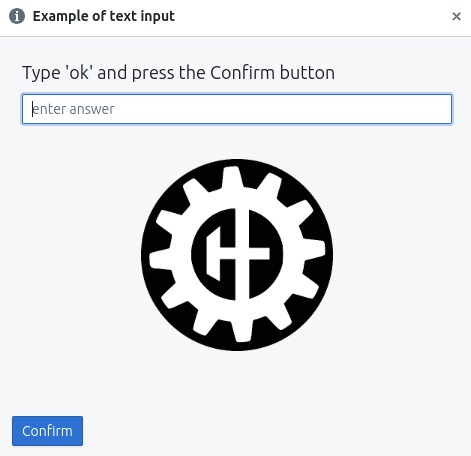
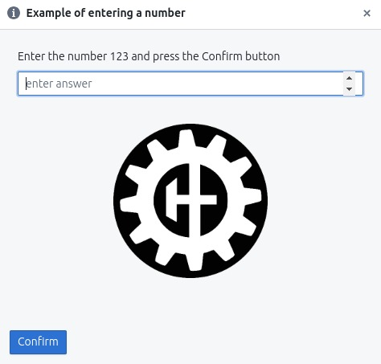
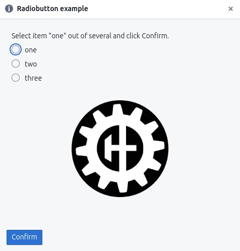
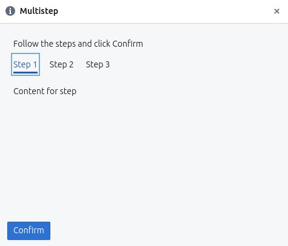
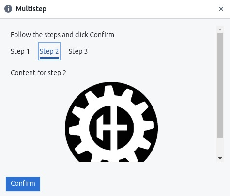

# HardPy panel

The **hardpy panel** or operator panel is a web interface that displays and controls the testing process in **HardPy**.

## Capability

**HardPy panel** allows you to:

- Start and stop testing;
- Interact with [dialog box](hardpy_panel.md#dialog-box) during testing;
- Browse:
    - Test run name.
    - Test run status.
    - Test module name.
    - Duration of test modules execution.
    - Test module status.
    - Test case name.
    - Test case message.
    - Test case status.
- Browse current [statestore](database.md#statestore-scheme) state in debug mode.

## Usage

### Launch operator panel

Use the [hardpy run](./cli.md#hardpy-run) command to start the web server.
After this open page http://localhost:8000/ in the browser.

When the operator panel is running, you can run tests through the web interface or through
the pytest launcher (in a terminal or from another application).

### Start and stop tests

The operator panel contains a test start/stop button in the lower right corner of the screen.
The user can start/stop tests using the space key.

### Settings

The operator panel contains a setting button in the top right corner.

#### debug mode

The user can view the **statestore** database online by clicking on 
the **Turn on the debug mode** button.

Debug mode is disabled by default.

#### sound

The user can turn on the sound of the end of the test by clicking on 
the **Turn on the sound** button.

Sound is disabled by default.

### Dialog box

For user interaction with the test, it is possible to use dialog boxes.
An example of usage can be seen in the example [dialog box](../examples/dialog_box.md) and in [dialog box documentation](pytest_hardpy/#run_dialog_box).
Currently, there are some types of dialog boxes.

Any dialog box can contain an image.

* Allows change width through `width` parameter.
* Allows change border thickness through `border` parameter.
* Allows next image types: gif, jpeg, pjpeg, png, svg+xml, tiff, vnd.microsoft.icon, vnd.wap.wbmp, webp.

#### basic dialog box

Contains an instruction or question and a `confirm` button for confirmation.

Base dialog box with image:

#### text input field

Contains an instruction or question, a text input field, and a `confirm` button for confirmation.
The text is transmitted in UTF-8 encoding.

Text input dialog box with image:

#### number input field

Contains an instruction or question, a number input field, and a `confirm` button for confirmation.

* Allows float numbers with a dot separator.
* Allows negative numbers.
* Allows numbers to be entered using **E notation** with `e`, e.g. `2e3`.
* The entered numbers will be converted to float.

Dialog box with number input and image:

#### radiobutton

Contains radiobutton widget.

* The user selects one option from several possible ones.
* Returns the contents of the selected item as a string.

Dialog box with radiobutton and image:

#### checkbox

Contains checkbox widget.

* The user selects several options from several possible ones.
* Returns a list with the contents of the selected items.

Dialog box with checkbox and image:

#### multiple steps

Contains an instruction with multiple steps and `confirm` button for confirmation.
Allows steps with text and image.

=== "Step 1"
    

=== "Step 2"
    

=== "Step 3"
    

#### warning window

If the user clicks `confirm` without entering anything, a warning window will be displayed.

#### error notification

If the user closes the dialog box (using the cross in the upper right corner),
the tests will be stopped, an error message will be displayed.

### Operator message

The messages to the operator are similar to [dialog boxes](#dialog-box), 
but do not contain a **Confirm** button and should be called outside 
the execution of the test plan, for example in case of exception 
catching in the `conftest.py` file. 
For more information, see the example [operator message](./../examples/operator_msg.md)
or in the function description [set_operator_message](./pytest_hardpy.md#set_operator_message).
