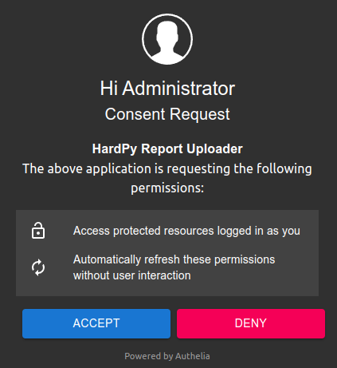

# StandCloud

## About StandCloud

**StandCloud** is a cloud management tool for electronics manufacturing.
Test data is crucial for evaluating performance.
StandCloud allows you to explore data patterns, create visualizations, and gain insights.
This helps in identifying potential trends and opportunities.
It allows you to identify potential limitations.

For more information, visit the **StandCloud** [website](https://everypin.io/standcloud).

## StandCloud and HardPy integration

**HardPy** allows test result data to be stored in the **StandCloud**.
For an example of StandCloud and HardPy integration,
see [StandCloud example](../examples/stand_cloud.md).

To authorize in **StandCloud** you need to know the address of your **StandCloud** service.
To obtain one, contact **info@everypin.io**.

Address must be added to **hardpy.toml** in `stand_cloud` section:

```toml
[stand_cloud]
address = "demo.standcloud.localhost"
```

You need to run the command.

```bash
hardpy sc-login <stand_cloud_address>
```
where <stand_cloud_address> is the **StandCloud** service address.
Then go to the authorization link in the terminal and open the link to the browser.
You will need to enter your StandCloud login and password.
After successful authorization, you should press the `Accept` button.



After which a page will appear in the browser informing about successfully issued token.
Otherwise, an error message will appear on the page.
The browser can be closed.
The `Registration completed` message should appear in the terminal with
the start of the registration.

To check the **StandCloud** connection status, run the command.

```bash
hardpy sc-login --check <stand_cloud_address>
```

The **StandCloud** authentication time is updated each time you interact with **StandCloud**.
If you do not use StandCloud services, the authentication will be canceled and the
`hardpy sc-login` function must be called again.
To clarify and edit your authentication time case, you can contact **info@everypin.io**.

To logout from **StandCloud** service run the command.

```bash
hardpy sc-logout
```

## HardPy rules

### Database mandatory fields

In order to populate the **StandCloud** database,
it is mandatory to populate some fields in the HardPy database.

1. DUT part number. Fills with the
   [set_dut_part_number](./pytest_hardpy.md#set_dut_part_number) function.
2. Test stand name. Fills with the
   [set_stand_name](./pytest_hardpy.md#set_stand_name) function.

So, a minimal example of a test plan for successfully filling a **StandCloud** database::

```python
import hardpy

def test_example():
    hardpy.set_dut_part_number("part_number_example")
    hardpy.set_stand_name("stand_name_example")
```

These database fields are required for minimal **StandCloud** analytics.
Other required database fields are automatically filled by HardPy.
See **HardPy** database specification in [Runstore](./database.md#runstore-scheme) section.

### General guidelines

Some tips for getting the best analytics in **StandCloud**.

1. Use the [set_dut_serial_number](./pytest_hardpy.md#set_dut_serial_number)
   to store DUT serial number.
   The serial number allows you to distinguish between units with
   the same part number. It also allows you to analyze the
   number of attempts to test a device.
2. Use the [set_case_artifact](./pytest_hardpy.md#set_case_artifact),
   [set_module_artifact](./pytest_hardpy.md#set_module_artifact),
   and [set_run_artifact](./pytest_hardpy.md#set_run_artifact)
   to store important information, such as measurement results or case attempt.
   Artifacts are not displayed in the operator panel.
   They can contain more complex data structures and can be used
   for data analysis, unlike [set_message](./pytest_hardpy.md#set_message)
   which only stores strings.
3. Use the [set_stand_info](./pytest_hardpy.md#set_stand_info),
   [set_dut_info](./pytest_hardpy.md#set_dut_info) and
   [set_driver_info](./pytest_hardpy.md#set_driver_info)
   to store important information about DUT or test stand.
   Don't store DUT or test stand information such as hardware/software
   revisions or stand components in artifacts.
4. Use the [case_name](./pytest_hardpy.md#case_name)
   and [module_name](./pytest_hardpy.md#module_name)
   markers for human-readable names.
   They make it easier to analyze the tests.
