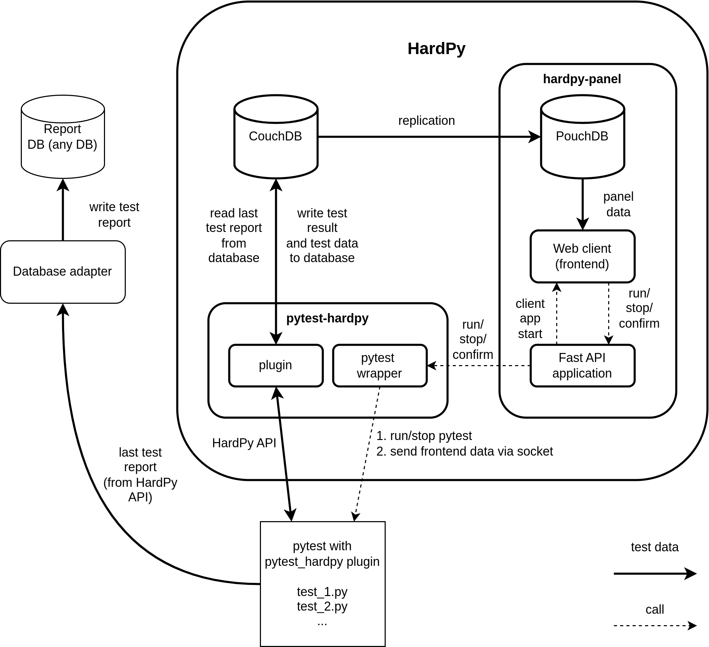

# HardPy structure

**HardPy** includes several parts.

## pytest-hardpy

* The pytest wrapper for running pytest from the **HardPy** operator panel.
* The pytest plugin with API for storing data in a database.

## HardPy operator panel

* Web interface for viewing tests and starting/stopping tests.
* FastAPI application for processing frontend commands.
* PouchDB - web database for synchronizing data from CouchDB and the hardpy operator panel.

## CouchDB

* Database to store current test data and store all test results.

## Database adapter

* HardPy allows you to use a simple database adapter to store test results in CouchDB.
* A developer can create a database adapter to store test results in any database.

## Structural scheme

{ align=left, width="800" }
