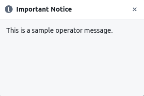

# Operator message

The [set_operator_message](./../documentation/pytest_hardpy.md/#set_operator_message)
function is intended for sending messages to the operator.
Operator messages are required to promptly inform the operator of
problems if they occur before the test begins or after the test is completed.



### how to start

1. Launch [CouchDH instance](../documentation/database.md#couchdb-instance).
2. Create a directory `<dir_name>` with the files described below.
3. Launch `hardpy run <dir_name>`.

### description

The `set_operator_message()` function is used to send a message to the operator,
which is stored in the **statestore** database.
This function is primarily intended for events that occur outside of the testing environment.
For messages during testing, please use the [run_dialog_box](./../documentation/pytest_hardpy.md/#run_dialog_box) function.

To use:

Call method `set_operator_message()` if you want a message to appear in
the operator panel for the operator when the condition you specify is met.

### conftest.py

Contains settings and fixtures for all tests:

- The `finish_executing` function generates a report and saves it to the database.
- The `test_end_message` function shows message about completing of testing.
- The `fill_list_functions_after_test` function populates a list of actions to be performed post-test. You may rename this function as you want.

If the report database doesn't exist, the report won't be saved, and an error message will be displayed to the operator. Otherwise, a success message will be shown indicating successful report saving.

```python
import pytest
from hardpy import (
    CouchdbConfig,
    CouchdbLoader,
    get_current_report,
    set_operator_message,
)

def finish_executing():
    report = get_current_report()
    try:
        if report:
            loader = CouchdbLoader(CouchdbConfig(port=5986))
            loader.load(report)
            set_operator_message(
                msg="Saving report was successful",
                title="Operator message",
            )
    except RuntimeError as e:
        set_operator_message(
            msg='The report was not recorded with error: "' + str(e) + '"',
            title="Operator message",
        )

def test_end_message():
    set_operator_message(
        msg="Testing completed",
        title="Operator message",
    )

@pytest.fixture(scope="session", autouse=True)
def fill_list_functions_after_test(post_run_functions: list):
    post_run_functions.append(test_end_message)
    post_run_functions.append(finish_executing)
    yield
```

### test_1.py

Contains the simplest example of a valid test.

```python
def test_one():
    assert True
```
